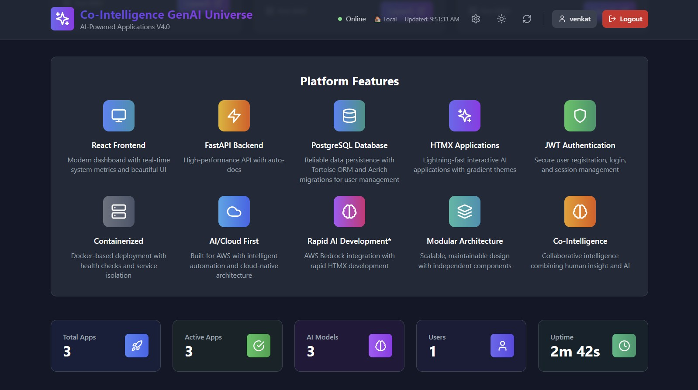
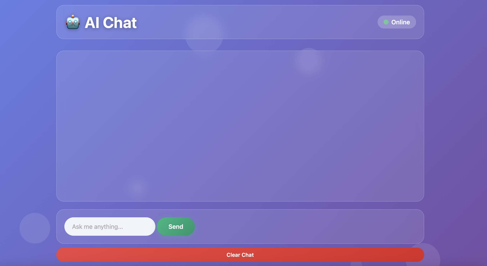

# 🚀 Co-Intelligence GenAI Universe V4.0

**Where Human Meets AI Intelligence**

A modular, production-ready platform built with React, FastAPI, HTMX, and AWS Bedrock - enabling rapid co-intelligence development through scalable architecture with secure JWT authentication and modern async database operations that work seamlessly in both local and cloud environments.

## 🎯 Platform Features

- **🚀 React Frontend** - Modern dashboard with real-time system metrics and beautiful UI
- **⚡ FastAPI Backend** - High-performance API with auto-docs and native async operations
- **🗄️ PostgreSQL Database** - Reliable data persistence with Tortoise ORM and Aerich migrations for user management
- **🎨 HTMX Applications** - Lightning-fast interactive AI applications with gradient themes
- **🔐 JWT Authentication** - Secure user registration, login, and session management
- **🐳 Containerized** - Docker-based deployment with health checks and service isolation
- **☁️ AI/Cloud First** - Built for AWS with intelligent automation and cloud-native architecture
- **🧠 Rapid AI Development** - AWS Bedrock integration with rapid HTMX development
- **🏗️ Modular Architecture** - Scalable, maintainable design with independent components
- **🤖 Co-Intelligence** - Collaborative intelligence combining human insight and AI
- **🔄 Modern ORM** - Tortoise ORM for native async database operations and better performance

## 📸 Platform Screenshots

### Main Dashboard - React Frontend

*Modern React frontend with real-time system metrics, app status monitoring, and beautiful dark theme interface*

### Platform Features and Dashboard Stats

*Complete view of available AI applications with launch capabilities, featuring the new HTMX apps with floating particles*

### API Documentation - Interactive Swagger UI - Authentication

*Complete JWT authentication system with user registration, login, and secure session management for protected AI applications*

### API Documentation Interactive Swagger UI

*Interactive Swagger UI showing all available API endpoints for Bedrock AI services and system management*

### AI Chat App - Beautiful Blue Theme with Floating Particles

*Stunning HTMX AI Chat interface featuring blue gradient background, floating particle animations, modern chat bubbles, and real-time "Online" status indicator*

### Document Analysis App - Beautiful Green Theme with Floating Particles

*HTMX Document Analysis interface with green gradient background, floating particles, drag-and-drop file upload, colorful analysis type cards, and seamless user experience*

### Web Search App - Beautiful Orange Theme with Floating Particles

*HTMX Web Search interface featuring orange gradient background, floating particle animations, AI-powered search results, and clean modern design with real-time backend connectivity*

## 🏗️ Architecture

```
┌─────────────────┐    Launch App    ┌──────────────────┐
│   React         │ ──────────────► │   HTMX Apps      │
│   Landing Page  │                 │   Beautiful UI   │
│   (Port 3000)   │                 │   (Port 8501+)   │
└─────────────────┘                 └──────────────────┘
         │                                    │
         │ HTTP/REST                          │
         ▼                                    │
┌──────────────────┐                         │
│   FastAPI        │ ◄───────────────────────┘
│   Backend        │
│   (Port 8000)    │
└──────────────────┘
         │
         ▼
┌──────────────────┐
│   AWS Bedrock    │
│   Claude 3 Haiku │
└──────────────────┘
```

## 🌍 Deployment Environments

### 🏠 Local Development
- **Perfect for:** Development, testing, and local demos
- **Access:** http://localhost:3000
- **Configuration:** Automatic localhost detection
- **Features:** Hot reload, debug mode, development tools

### ☁️ Cloud Deployment (EC2)
- **Perfect for:** Production, sharing, and scalable deployment
- **Access:** http://your_ec2_ip:3000
- **Configuration:** Set PUBLIC_IP in .env file
- **Features:** Production optimization, auto-restart, security headers

## 🔐 Authentication System (Enhanced in V4.0)

### User Management
- **🔑 User Registration** - Create new accounts with name, email, username, and password
- **🚪 Secure Login/Logout** - JWT-based authentication with session management
- **👤 User Profiles** - Complete user information and account management
- **🔒 Protected Routes** - All AI applications require authentication

### Security Features
- **🛡️ JWT Tokens** - Secure JSON Web Token authentication
- **🔄 Token Passing** - Seamless authentication between React frontend and HTMX apps
- **⏰ Session Management** - Configurable token expiration and refresh
- **🗄️ Database Integration** - PostgreSQL with Tortoise ORM and Aerich migrations for user data
- **🔐 Password Security** - Secure password hashing and validation

### Authentication Flow
1. **Register/Login** → User creates account or logs in via React frontend
2. **JWT Token** → Backend generates secure JWT token upon successful authentication
3. **Token Storage** → Frontend stores token securely in localStorage
4. **App Launch** → Token passed to HTMX apps via URL parameter
5. **API Requests** → All AI endpoints require valid JWT token in Authorization header

## 📱 Available Apps

### 🤖 AI Chat
- **AI-powered chat** using AWS Bedrock Claude 3 Haiku models
- **Real-time responses** with conversation history
- **Environment-aware interface** with connectivity testing
- **Status**: ✅ **Working** - Tested with AWS Bedrock
- **Access**: 
  - Local: http://localhost:8501
  - Cloud: http://your_ec2_ip:8501

### 📄 Document Analysis
- **Document upload** support (PDF, DOCX, TXT)
- **AI-powered text analysis** with multiple options:
  - Summary
  - Key Points
  - Important Questions
  - Detailed Analysis
- **Environment-aware processing** with backend connectivity tests
- **Status**: ✅ **Working** - Ready for document processing
- **Access**: 
  - Local: http://localhost:8502
  - Cloud: http://your_ec2_ip:8502

### 🔍 Web Search
- **AI-powered web search** using DuckDuckGo and AWS Bedrock
- **Intelligent rate limiting** with automatic retry logic
- **AI analysis** of search results for comprehensive insights
- **Environment-aware configuration** with smart URL handling
- **Status**: ✅ **Working** - Enhanced with rate limit handling
- **Access**: 
  - Local: http://localhost:8503
  - Cloud: http://your_ec2_ip:8503

## 🚀 Quick Start

### Prerequisites
- Docker & Docker Compose
- AWS credentials (for AI features)
- For EC2: Security Group with ports 22, 3000, 8000, 8501-8503 open

### Environment Setup

The platform uses a **single `.env` file** that works for both local and cloud deployments.

```bash
# 1. Edit the .env file
nano .env

# 2. Add your AWS credentials:
AWS_ACCESS_KEY_ID=your_access_key_here
AWS_SECRET_ACCESS_KEY=your_secret_key_here

# 3. Set PUBLIC_IP based on your deployment:
# For Local Development: PUBLIC_IP=localhost
# For Cloud/EC2 Deployment: PUBLIC_IP=your_ec2_public_ip
```

### Deployment

Choose your preferred deployment method. Both work with the same `.env` file:

#### Method 1: Using Deploy Script (Recommended)
```bash
# 1. Set PUBLIC_IP in .env file (localhost for local, your_ec2_ip for cloud)
# 2. Run deployment script
./scripts/deploy.sh

# The script automatically:
# - Detects your environment (local/cloud)
# - Uses appropriate Docker Compose file
# - Provides health checks and validation
# - Shows access URLs when complete
```

#### Method 2: Direct Docker Compose
```bash
# For Local Development:
# Set PUBLIC_IP=localhost in .env, then:
docker-compose up -d --build

# For Cloud/EC2 Deployment:
# Set PUBLIC_IP=your_ec2_ip in .env, then:
docker-compose -f docker-compose.prod.yml up -d --build
```

### Access Your Applications

After deployment, access your applications at:

**Local Development (PUBLIC_IP=localhost):**
- 🏠 Frontend: http://localhost:3000
- 🤖 AI Chat: http://localhost:8501
- 📄 Document Analysis: http://localhost:8502
- 🔍 Web Search: http://localhost:8503
- 🔧 Backend API: http://localhost:8000
- 📚 API Docs: http://localhost:8000/docs

**Cloud Deployment (PUBLIC_IP=your_ec2_ip):**
- 🏠 Frontend: http://your_ec2_ip:3000
- 🤖 AI Chat: http://your_ec2_ip:8501
- 📄 Document Analysis: http://your_ec2_ip:8502
- 🔍 Web Search: http://your_ec2_ip:8503
- 🔧 Backend API: http://your_ec2_ip:8000
- 📚 API Docs: http://your_ec2_ip:8000/docs

### Management Commands

#### Database Operations (Aerich):
```bash
# Create new migration
docker-compose exec backend aerich migrate --name "description_of_changes"

# Apply migrations
docker-compose exec backend aerich upgrade

# Rollback migration
docker-compose exec backend aerich downgrade

# Show migration history
docker-compose exec backend aerich history
```

#### View Logs:
```bash
# Local
docker-compose logs -f

# Cloud
docker-compose -f docker-compose.prod.yml logs -f
```

#### Stop Services:
```bash
# Local
docker-compose down

# Cloud
docker-compose -f docker-compose.prod.yml down
```

#### Restart Services:
```bash
# Local
docker-compose restart

# Cloud
docker-compose -f docker-compose.prod.yml restart
```

## 🛠️ Development

### Project Structure
```
Co-IntelligenceGenAIUniverse/
├── backend/                 # FastAPI backend
│   ├── app/
│   │   ├── api/v1/         # API endpoints
│   │   ├── services/       # Business logic (Bedrock service)
│   │   └── main.py         # FastAPI application
├── react-frontend/         # React landing page
├── htmx-apps/              # Beautiful HTMX applications
│   ├── ai_chat.html        # AI Chat app (Blue theme)
│   ├── document_analysis.html # Document analysis (Green theme)
│   ├── web_search.html     # Web Search (Orange theme)
│   └── server.py           # FastAPI server for HTMX apps
├── config/                # Configuration files
│   └── apps.json          # App registry
├── scripts/               # Automation scripts
│   ├── deploy.sh          # Deployment script
│   ├── add-app.py         # App creation
│   └── test-system.sh     # System testing
├── docker-compose.yml     # Development configuration
├── docker-compose.prod.yml # Production configuration
└── .env                   # Unified environment configuration
```

## 🎨 Enhanced Frontend Features

### 🌙 Dark/Light Mode
- **Theme Toggle** - Switch between dark and light themes
- **Persistent Preferences** - Theme choice saved automatically
- **Smooth Transitions** - All UI elements adapt seamlessly

### 📊 Real-time Dashboard
- **Auto-refresh** - Updates every 30 seconds
- **Live Status** - System health monitoring with environment info
- **Performance Metrics** - App usage and uptime tracking
- **Environment Display** - Shows current deployment environment

### ⚙️ Management Panel
- **Analytics** - Usage patterns and performance insights
- **Environment Info** - Current deployment status and configuration
- **Backup** - Configuration management tools
- **Security** - Access monitoring and logs

## 🔧 API Endpoints

### Environment Configuration
- `GET /api/v1/config` - Get environment configuration and URLs
- `GET /health` - Health check with environment details

### Bedrock AI Services
- `POST /api/v1/bedrock/chat` - AI chat with conversation history
- `POST /api/v1/bedrock/analyze-text` - Analyze text content
- `POST /api/v1/bedrock/analyze-document` - Analyze uploaded documents

### System Management
- `GET /api/v1/apps` - Get available apps list (environment-aware URLs)
- `POST /api/v1/apps` - Add new app configuration
- `GET /api/v1/system/stats` - System statistics with environment info

### Documentation
- `GET /docs` - Interactive API documentation
- `GET /redoc` - Alternative API documentation

## 🌍 Cloud Deployment Guide

### EC2 Setup
1. **Launch EC2 Instance** (Amazon Linux 2 or RHEL/CentOS recommended)
2. **Configure Security Group:**
   ```
   Port 22   (SSH)          - Your IP
   Port 3000 (Frontend)     - 0.0.0.0/0
   Port 8000 (Backend API)  - 0.0.0.0/0
   Port 8501 (AI Chat)      - 0.0.0.0/0
   Port 8502 (Doc Analysis) - 0.0.0.0/0
   Port 8503 (Web Search)   - 0.0.0.0/0
   ```

3. **Install Dependencies:**
   ```bash
   # Update system
   sudo yum update -y
   
   # Install Docker
   sudo yum install -y docker
   sudo systemctl start docker
   sudo systemctl enable docker
   sudo usermod -aG docker $USER
   
   # Install Docker Compose
   sudo curl -L "https://github.com/docker/compose/releases/download/v2.20.0/docker-compose-$(uname -s)-$(uname -m)" -o /usr/local/bin/docker-compose
   sudo chmod +x /usr/local/bin/docker-compose
   
   # Install Git
   sudo yum install -y git
   
   # Logout and login again for Docker group changes
   ```

4. **Deploy Application:**
   ```bash
   # Clone your repository
   git clone <your-repo-url>
   cd Co-IntelligenceGenAIUniverse
   
   # Setup environment
   nano .env
   # Set PUBLIC_IP=your_ec2_public_ip and add AWS credentials
   
   # Deploy
   ./scripts/deploy.sh
   # OR
   docker-compose -f docker-compose.prod.yml up -d --build
   ```

### Environment Variables for Cloud
```bash
# Cloud-specific configuration in .env file
DEPLOYMENT_ENV=cloud
HOST_IP=0.0.0.0
PUBLIC_IP=your-ec2-public-ip
ENVIRONMENT=production
DEBUG=false

# AWS Configuration
AWS_DEFAULT_REGION=us-east-1
AWS_ACCESS_KEY_ID=your_access_key
AWS_SECRET_ACCESS_KEY=your_secret_key

# Dynamic URLs (automatically configured using PUBLIC_IP variable)
REACT_APP_API_URL=http://${PUBLIC_IP}:8000/api/v1
REACT_APP_AI_CHAT_URL=http://${PUBLIC_IP}:8501
REACT_APP_DOCUMENT_ANALYSIS_URL=http://${PUBLIC_IP}:8502
REACT_APP_WEB_SEARCH_URL=http://${PUBLIC_IP}:8503
```

## 📊 Platform Benefits

- **🏗️ Modular Architecture** - Independent, scalable components
- **⚡ Rapid Development** - New AI apps in under 3 minutes
- **🤖 Co-Intelligence** - Human-AI collaborative experiences
- **🐳 Container-Based** - Docker orchestration with health checks
- **🎨 Modern UI** - Professional React interface with themes
- **🔧 Developer Friendly** - Hot reload, comprehensive tooling
- **🌍 Environment Agnostic** - Works seamlessly local and cloud
- **🔄 Auto-Configuration** - Smart environment detection
- **🛡️ Production Ready** - Security headers, error handling, monitoring

## 🛠️ Troubleshooting

### Common Issues

#### Environment Configuration
```bash
# Check current environment variables
cat .env | grep PUBLIC_IP

# Verify Docker containers are running
docker ps

# Check container logs
docker-compose logs -f  # Local
docker-compose -f docker-compose.prod.yml logs -f  # Cloud
```

#### Browser Cache (Most Common)
If changes don't appear after updates:
```bash
# Hard refresh in browser
# Chrome/Edge: Ctrl+Shift+R (Windows) or Cmd+Shift+R (Mac)
# Firefox: Ctrl+F5 (Windows) or Cmd+Shift+R (Mac)
# Safari: Cmd+Option+R (Mac)

# Or use incognito/private mode
```

#### Docker Issues
```bash
# Reset Docker environment
docker-compose down --volumes --remove-orphans  # Local
docker-compose -f docker-compose.prod.yml down --volumes --remove-orphans  # Cloud

# Rebuild from scratch
docker system prune -f
docker-compose up -d --build  # Local
docker-compose -f docker-compose.prod.yml up -d --build  # Cloud
```

#### Port Conflicts
```bash
# Check port usage
lsof -i :3000 -i :8000 -i :8501 -i :8502 -i :8503

# Kill processes if needed
sudo kill -9 $(lsof -t -i:3000)
```

#### AWS Credentials
```bash
# Verify AWS credentials
aws sts get-caller-identity

# Or check .env file
cat .env | grep AWS

# Test AI functionality directly
curl -X POST http://localhost:8000/api/v1/bedrock/chat \
  -H "Content-Type: application/json" \
  -d '{"message": "Hello, test message"}'
```

#### Cloud Access Issues
```bash
# Check EC2 Security Group settings
# Ensure ports 3000, 8000, 8501-8503 are open to 0.0.0.0/0

# Check if services are running
curl http://your_ec2_ip:8000/health

# Check environment configuration
curl http://your_ec2_ip:8000/api/v1/config
```

## 📄 License

MIT License - see LICENSE file for details

---

**Built with ❤️ using React, FastAPI, HTMX & AWS Bedrock**

## 🎉 Quick Commands Summary

```bash
# 🔍 Check environment configuration
cat .env | grep PUBLIC_IP

# 🚀 Deploy locally (Choose one method)
# Method 1: Using deploy script
./scripts/deploy.sh
# Method 2: Direct Docker Compose
docker-compose up -d --build

# 🚀 Deploy on cloud (Choose one method)
# Method 1: Using deploy script
./scripts/deploy.sh
# Method 2: Direct Docker Compose
docker-compose -f docker-compose.prod.yml up -d --build

# 📊 View logs
docker-compose logs -f                                    # Local
docker-compose -f docker-compose.prod.yml logs -f        # Cloud

# 🔄 Restart services
docker-compose restart                                    # Local
docker-compose -f docker-compose.prod.yml restart        # Cloud

# 🛑 Stop everything
docker-compose down                                       # Local
docker-compose -f docker-compose.prod.yml down           # Cloud

# 🌍 Check environment
curl http://localhost:8000/api/v1/config                 # Local
curl http://your_ec2_ip:8000/api/v1/config              # Cloud

# 🧪 Test system (using deploy script features)
./scripts/test-system.sh
```

## 🌟 New in Version 1.0

- ✅ **Core Platform Architecture** - React frontend + FastAPI backend + Streamlit apps
- ✅ **AWS Bedrock Integration** - Claude 3 Haiku AI model integration
- ✅ **Three AI Applications** - AI Chat, Document Analysis, and Web Search in Streamlit
- ✅ **Docker Containerization** - Complete Docker Compose setup
- ✅ **Streamlit UI** - Interactive web applications with Streamlit framework
- ✅ **Real-time AI Chat** - Conversation history and streaming responses
- ✅ **Document Processing** - PDF, DOCX, TXT file analysis with multiple analysis types
- ✅ **Web Search Integration** - DuckDuckGo search with AI analysis
- ✅ **Interactive API Documentation** - Swagger UI with all endpoints
- ✅ **Health Monitoring** - System health checks and status indicators

## 🌟 New in Version 2.0

- ✅ **HTMX Migration** - Complete migration from Streamlit to HTMX for all 3 apps
- ✅ **Beautiful HTMX UI** - Gradient themes with floating particle animations (Blue, Green, Orange)
- ✅ **Enhanced User Experience** - Modern chat bubbles, drag-and-drop, smooth animations
- ✅ **Unified Environment Configuration** - Single .env file for both local and cloud
- ✅ **Variable-Based URLs** - All URLs use PUBLIC_IP variable for easy switching
- ✅ **Cloud Deployment Support** - EC2 deployment with production configurations
- ✅ **Enhanced Frontend** - Environment-aware React application
- ✅ **Production Optimization** - Separate configurations for dev/prod
- ✅ **Auto-Configuration** - Smart environment detection and URL management
- ✅ **Improved Performance** - Faster loading and better responsiveness with HTMX

## 🌟 New in Version 3.0

- ✅ **JWT Authentication System** - Secure user registration, login, and logout functionality
- ✅ **Protected AI Applications** - All AI apps now require authentication for access
- ✅ **User Management** - Complete user profile system with session management
- ✅ **Secure Token Passing** - Seamless authentication between React frontend and HTMX apps
- ✅ **Dashboard User Stats** - Real-time user count and system metrics display
- ✅ **Authentication Middleware** - Comprehensive security layer for all API endpoints
- ✅ **Database Integration** - PostgreSQL with SQLAlchemy for user data persistence
- ✅ **Enhanced Security** - Secure credential management and token validation

## 🌟 New in Version 4.0

- ✅ **Tortoise ORM Migration** - Complete migration from SQLAlchemy + Alembic to Tortoise ORM + Aerich
- ✅ **Native Async Operations** - All database operations are now truly async for better performance
- ✅ **Modern Database Layer** - Intuitive model definitions with built-in validation and better IDE support
- ✅ **Aerich Migrations** - Modern migration system designed specifically for async applications
- ✅ **Enhanced Performance** - Improved connection pooling and reduced overhead
- ✅ **Better Developer Experience** - Cleaner code, enhanced autocomplete, and intuitive model definitions
- ✅ **FastAPI Integration** - Native support designed specifically for FastAPI applications
- ✅ **Database Cleanup** - Removed all legacy Alembic files and references
- ✅ **Production Ready** - Fully tested migration with backward compatibility for existing data
